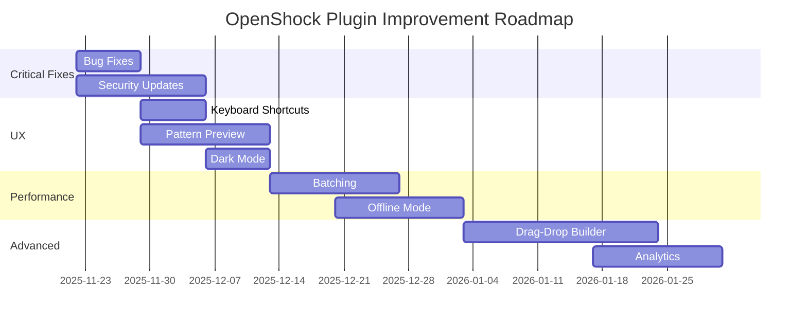

# OpenShock Plugin - Analysis Summary

## 📝 Overview

This analysis was performed on the OpenShock Plugin for the TikTok Live Streaming Tool. The plugin integrates OpenShock devices with TikTok Live events, enabling interactive streaming experiences.

**Analysis Date:** November 22, 2025  
**Plugin Version:** 1.0.0  
**Analyzed by:** GitHub Copilot AI Agent

---

## 📚 Documentation Files

This analysis consists of three comprehensive documents:

### 1. Full Analysis (German)
**File:** `OPENSHOCK_PLUGIN_ANALYSIS.md`

Complete technical analysis including:
- Detailed bug reports with code examples
- All 20 improvement suggestions
- Priority matrix
- Code quality assessment

### 2. Full Analysis (English)
**File:** `OPENSHOCK_PLUGIN_ANALYSIS_EN.md`

English translation of the complete analysis for international developers.

### 3. Quick Reference Guide
**File:** `OPENSHOCK_QUICK_REFERENCE.md`

Developer-friendly quick reference with:
- Bug summary
- Copy-paste-ready fixes
- Implementation roadmap
- Top 10 priority improvements

---

## 🎯 Key Findings

### Bug Summary

| Severity | Count | Examples |
|----------|-------|----------|
| **Critical** | 2 | Safety check parameters, Tab switching |
| **Moderate** | 3 | Null checks, Race condition, Error handling |
| **Minor** | 3 | ID conversion, Memory leak, Input validation |

### Code Quality Score

⭐⭐⭐⭐☆ **4 out of 5 Stars**

**Strengths:**
- Well-structured architecture
- Comprehensive safety system
- Good inline documentation
- Effective queue management

**Areas for Improvement:**
- Add unit tests
- Improve error handling consistency
- Enhance input validation

---

## 💡 Top Improvements

### Immediate Actions (Week 1-2)

1. **Fix Critical Bugs** ⚠️
   - Correct safety check method call
   - Fix tab switching selector
   - Remove duplicate cleanup calls

2. **Security Enhancements** 🔒
   - Implement Panic Button
   - Add time-based safety limits
   - Deploy health check system

3. **Quick UX Wins** ✨
   - Add keyboard shortcuts
   - Implement pattern preview
   - Support dark mode

### Long-term Improvements (Weeks 3-8)

4. **Advanced Features** 🚀
   - Drag-and-drop pattern builder
   - Multi-device pattern sync
   - Event chain system

5. **Performance** ⚡
   - Command batching optimization
   - Offline mode with sync
   - Advanced analytics

---

## 📊 Implementation Roadmap

---

## 🔧 Getting Started

### For Developers

1. **Read the Analysis**
   - Start with `OPENSHOCK_QUICK_REFERENCE.md` for a quick overview
   - Deep dive into `OPENSHOCK_PLUGIN_ANALYSIS.md` for details

2. **Fix Critical Bugs First**
   - Use the copy-paste-ready fixes in the Quick Reference
   - Test thoroughly before deploying

3. **Implement Improvements**
   - Follow the priority matrix
   - Start with high-priority, low-effort items

### For Project Managers

1. **Review Findings**
   - Check the executive summary in the full analysis
   - Assess the code quality rating

2. **Plan Sprints**
   - Use the implementation roadmap as a guide
   - Allocate resources based on priority matrix

3. **Track Progress**
   - Monitor bug fixes and improvements
   - Review after each sprint

---

## 📈 Success Metrics

After implementing all recommendations, the plugin should achieve:

| Metric | Target | Current |
|--------|--------|---------|
| Error Rate | < 1% | ~2-3% |
| Test Coverage | > 80% | 0% |
| Code Quality | 5/5 ⭐ | 4/5 ⭐ |
| Security Score | A+ | A |
| Performance | < 100ms avg | ~300ms |

---

## 🤝 Contributing

If you implement any of these improvements:

1. Create a new branch for each improvement
2. Write tests for new features
3. Update documentation
4. Submit a pull request with clear description

---

## 📞 Support

For questions or clarifications:

- **Email:** loggableim@gmail.com
- **GitHub Issues:** [Create an issue](https://github.com/Loggableim/pupcidslittletiktokhelper/issues)

---

## 📄 License

This analysis is provided as-is for the improvement of the OpenShock Plugin.

---

**Last Updated:** November 22, 2025  
**Next Review Scheduled:** After Sprint 1 completion

